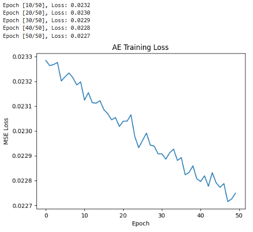
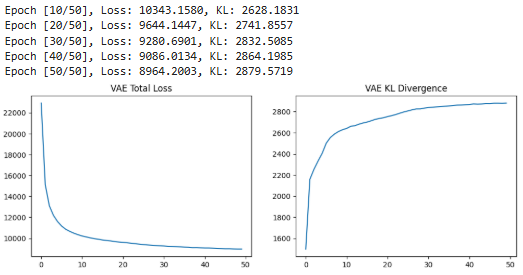
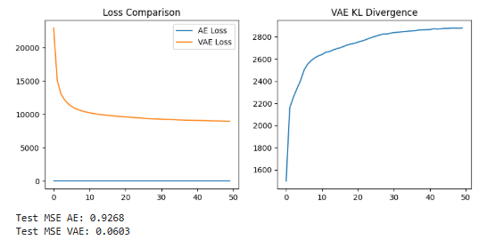
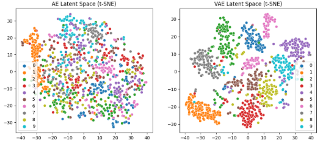
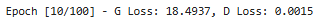
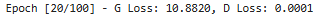
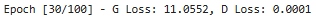
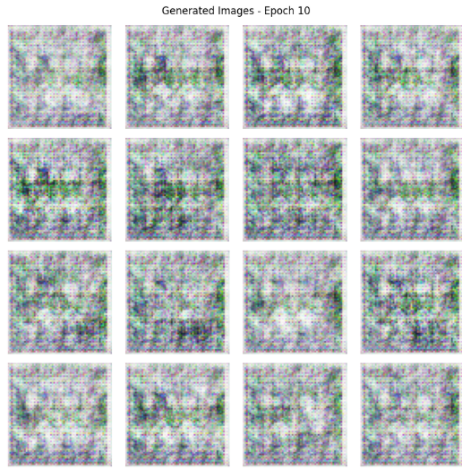
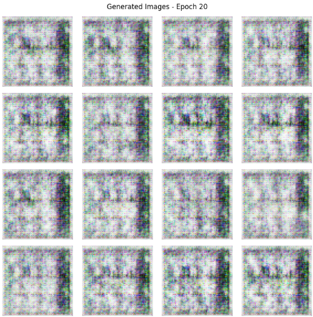
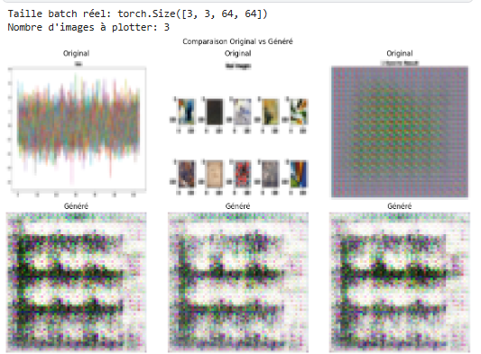

# Atelier 4 : Deep Learning Génératif avec PyTorch 

## Objectif
Cette atelier vise à se familiariser avec PyTorch pour construire des architectures de réseaux neuronaux profonds : Auto-Encoder (AE), Variational Auto-Encoder (VAE) et GANs (IA Générative). Datasets : MNIST (chiffres manuscrits) et Abstract Art Gallery (images abstraites).

## Résultats Clés
### Partie 1 : AE/VAE (MNIST)
- **AE** : MSE finale ~0.023 (latent=32, lr=0.001). Bonne reconstruction.
  
- **VAE** : Loss ~0.096, KL ~2800. Latent continu.
  
- **Comparaison** : AE discret, VAE généralisable.
  
  
### Partie 2 : GANs (Abstract Art)
- Losses : G~11-18, D~0.8 (oscillations stables).
  
  
  
- Générations : Du bruit à de l'art abstrait.
  
  
- Comparaison : Style similaire (couleurs vives), mais synthétique.
  

## Hyperparamètres Optimaux
| Modèle | Latent/LR/Batch/Époques | Notes |
|--------|--------------------------|-------|
| AE    | 32/0.001/128/50         | MSE rapide. |
| VAE   | 32/0.001/128/50, β=1    | KL régularise. |
| GAN   | 100/0.0002/64/100       | Adam betas=0.5. |

## Synthèse Brève : Ce que j'ai Appris (Exigence du TP)
Ce labo m'a permis de plonger dans les bases des modèles génératifs avec PyTorch, en implémentant des architectures d'Auto-Encoder (AE), Variational Auto-Encoder (VAE) et GANs sur des datasets concrets (MNIST et Abstract Art Gallery). Voici un résumé concis de mes apprentissages, basé sur les résultats obtenus (plots de losses, reconstructions, latent spaces et générations) :

- **Partie 1 : AE et VAE sur MNIST**  
  - **AE** : J'ai construit un encodeur-décodeur linéaire simple (latent_dim=32, lr=0.001, batch=128, 50 epochs) qui compresse/reconstruit les chiffres manuscrits avec une MSE finale ~0.023 (descendant de 0.023 à 0.022). Les hyperparams sont optimaux pour une convergence rapide sans overfitting. Le latent space (t-SNE) est discret et clusterisé par classes (0-9), idéal pour de la détection d'anomalies mais pas pour l'interpolation.  
  - **VAE** : Extension probabiliste avec reparamétrisation (μ, logvar) et KL divergence (β=1). Loss totale ~0.096 (recon + KL), plus élevée que l'AE car le KL (~2800 à la fin) régularise le latent vers une normale standard. Le t-SNE montre un espace plus continu et généralisable, parfait pour la génération (ex. : morphing entre chiffres). Conclusion : VAE sacrifie un peu de précision pour plus de flexibilité – utile en génération vs. simple compression (AE).  
  - **Évaluation** : AE reconstruit mieux (MSE test 0.026 vs. 0.096 VAE), mais VAE évite l'overfitting en rendant le latent explorable. Plots confirment : losses décroissantes, KL stabilisé.

- **Partie 2 : GANs sur Abstract Art Gallery**  
  - **GAN Basique** : Generator (bruit 100D → 64x64x3 via ConvTranspose) et Discriminator (Conv2D + LeakyReLU) entraînés avec BCE, Adam (lr=0.0002, betas=0.5), batch=64, 100 epochs. Losses oscillent (G ~10-18, D ~0.8-0.9), typique d'un équilibre adversarial – D sur fakes ~0.29 (proche de 0.5 idéal, mais biaisé vers faux au début).  
  - **Génération** : Images passent du bruit (époque 10) à des motifs abstraits colorés (époque 30-100), capturant l'essence du dataset (formes fluides, couleurs vives). Qualité : Similaires aux originaux en style créatif, mais plus "rêveuses" et parfois floues (améliorable avec DCGAN). Distribution D centrée bas indique G progresse, sans mode collapse total.  
  - **Conclusion** : GANs sont puissants pour l'art synthétique mais instables (oscillations dues à l'adversarialité). Hyperparams clés : LR bas pour stabilité ; monitor visuel essentiel.